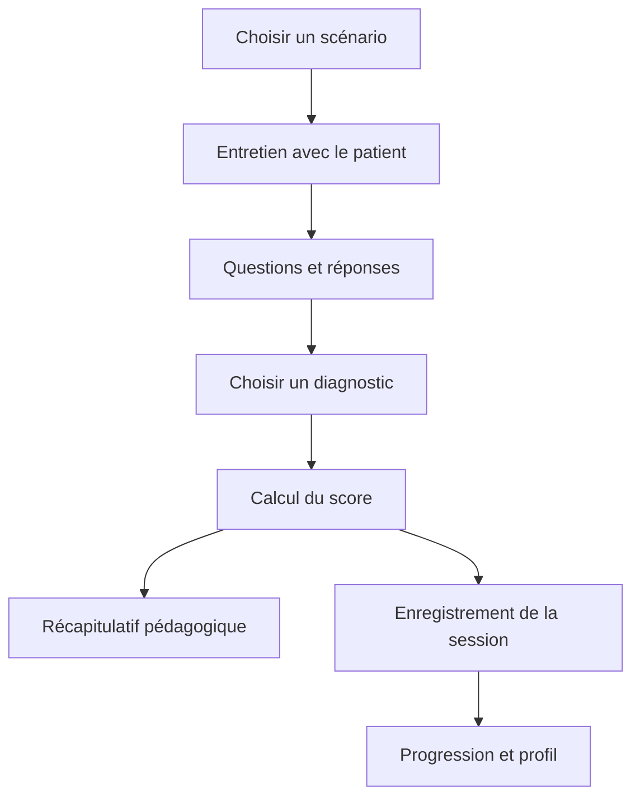

# Simulateur de formation des agents de santé

Application Flutter multiplateforme pour s'entraîner à mener un entretien avec un patient virtuel. L'agent recueille les informations, recherche les signes d'alerte, formule un diagnostic, puis reçoit un score et un récapitulatif pédagogique.

Le projet a été développé pour le Hack-Nation Global AI Hackathon, dans le track « Small AI for Development ». Il vise la formation des agents de santé communautaires, et non le diagnostic direct des patients.

> **Avertissement médical :** les scénarios et recommandations sont du contenu de démonstration et ne sont pas validés cliniquement. Cette application ne remplace ni une formation supervisée, ni un professionnel de santé, ni les protocoles médicaux locaux. Faire valider tout contenu par des professionnels compétents avant tout usage en formation réelle.

## Sommaire

- [Fonctionnalités](#fonctionnalités)
- [Parcours utilisateur](#parcours-utilisateur)
- [Modes de conversation](#modes-de-conversation)
- [Écrans](#écrans)
- [Architecture](#architecture)
- [Données et synchronisation](#données-et-synchronisation)
- [Installation et configuration](#installation-et-configuration)
- [Exécuter et vérifier](#exécuter-et-vérifier)
- [Limites actuelles](#limites-actuelles)
- [Pistes prioritaires](#pistes-prioritaires-pour-une-small-ai-accessible)
- [Documents du projet](#documents-du-projet)

## Fonctionnalités

- Scénarios d'entretien clinique embarqués, complétés par des scénarios synchronisés depuis Firestore.
- Patient virtuel incarné par Gemini Live en conversation vocale temps réel, ou par un moteur de dialogue local en mode hors ligne.
- Avatar animé dont l'expression suit l'état de l'entretien et, en mode Live, l'audio du patient.
- Diagnostic à choix multiples à la fin de l'entretien.
- Évaluation reproductible des questions clés, avec un poids supérieur pour les points critiques.
- Récapitulatif des questions couvertes ou manquées, des signes d'alerte, du diagnostic, des symptômes et de la conduite à tenir proposée.
- Historique des sessions, statistiques de progression, profil et liaison facultative à un compte email.
- Cache local des scénarios, et persistance Firestore pour les données disponibles hors connexion.

Les scénarios embarqués couvrent actuellement la fièvre chez un enfant, le saignement post-partum et la déshydratation. L'interface et les contenus de conversation sont principalement en anglais, même si certaines données internes et le code sont en français.

## Parcours utilisateur

1. L'agent sélectionne un cas présenté sous un titre neutre, qui ne révèle pas le diagnostic attendu.
2. Il mène l'entretien en parlant en mode Live, ou en saisissant ses questions en mode hors ligne.
3. Le patient répond aux questions posées. Les informations importantes sont révélées progressivement ; le patient ne donne pas spontanément son diagnostic.
4. L'agent termine l'entretien et choisit un diagnostic parmi plusieurs réponses plausibles.
5. L'application calcule le score et affiche les éléments couverts, les points manqués, les signes d'alerte et les informations pédagogiques du scénario.
6. La session est enregistrée dans Firestore quand un compte est disponible. L'historique alimente les écrans de progression et de profil.



Le score global combine 60 % de couverture des points clés et 40 % de justesse du diagnostic. Chaque point critique compte double dans le calcul de la couverture. Le même calcul est utilisé quel que soit le mode de conversation.

## Modes de conversation

| Mode | Fonctionnement | Réseau et données |
|---|---|---|
| **Live** | Gemini Live reçoit l'audio du microphone en continu, répond avec une voix générée et fournit les transcriptions affichées dans le fil de discussion. | Connexion nécessaire. L'audio est envoyé au service Gemini. |
| **Hors ligne — English** | L'agent écrit ses questions. `OfflinePatientBrain` peut utiliser Gecko (modèle anglais) et le matcher lexical pour choisir une réponse scénarisée. | Gecko peut être téléchargé une fois (environ 115 Mo). Après installation, la conversation fonctionne sans réseau et n'envoie pas les questions à Gemini. |
| **Hors ligne — Yorùbá (prototype)** | Un cas de fièvre chez l'enfant est disponible en Yorùbá. Il utilise un matcher lexical local et des réponses préécrites ; Gecko n'est pas utilisé pour cette langue. L'entretien se fait par texte. | Aucun envoi réseau pour les questions. Les formulations yoruba sont un brouillon à relire ; elles ne sont pas encore validées linguistiquement ou cliniquement. |

Le sélecteur de langue est disponible sur l'écran de choix des scénarios. En Yorùbá, le prototype expose uniquement le scénario de fièvre et passe automatiquement en mode hors ligne ; les autres scénarios et Gemini Live restent en anglais. Les réponses yoruba sont affichées en texte : aucun audio yoruba préenregistré n'est encore fourni. Le mode Live requiert une connexion et une clé Gemini valide.

## Écrans

| Écran | Fichier | Rôle |
|---|---|---|
| Choix du scénario | `lib/screens/simulation_screen.dart` | Page d'accueil. Affiche les scénarios par niveau de difficulté, permet leur synchronisation et donne accès au profil et à la progression. Le menu devient une barre latérale sur grand écran. |
| Entretien / simulation | `lib/screens/simulation_screen.dart` | Affiche l'avatar, l'état du patient, la conversation, les commandes vocales ou le champ de saisie, le feedback et l'action de diagnostic. Le layout s'adapte à la largeur de l'écran. |
| Diagnostic | `lib/screens/diagnosis_screen.dart` | Présente les diagnostics possibles sous forme de QCM et valide la réponse de l'agent. Déclenche aussi l'enregistrement de la session sans retarder l'affichage du récapitulatif. |
| Récapitulatif | `lib/screens/recap_screen.dart` | Présente le score, la réponse choisie, les points clés couverts ou manqués, les signes d'alerte et les informations cliniques du scénario. |
| Progression | `lib/screens/progress_screen.dart` | Affiche les statistiques et les dernières sessions disponibles dans Firestore, avec un accès à la gestion du compte. |
| Profil | `lib/screens/profile_screen.dart` | Permet de modifier le prénom, le nom et la photo, consulte les meilleurs scores par scénario et mène à la gestion du compte. |
| Compte | `lib/screens/account_screen.dart` | Permet de lier le compte anonyme à un email, de se connecter à un compte existant ou de se déconnecter. |
| Clé Gemini absente | `lib/main.dart` | Écran de configuration affiché si la constante Gemini est vide. Dans l'état du dépôt, elle contient un texte de remplacement non vide : il faut donc remplacer celui-ci avant d'utiliser les fonctions Gemini. |

## Architecture

```text
lib/
  main.dart                         Initialisation Flutter/Firebase, thème et écran racine
  firebase_options.dart             Configuration Firebase générée par FlutterFire
  models/
    scenario_bundle.dart            Format des scénarios synchronisés et conversion vers les modèles internes
  screens/
    simulation_screen.dart          Sélection de scénario, entretien et commandes
    diagnosis_screen.dart            QCM et validation du diagnostic
    recap_screen.dart                 Résultats et contenu pédagogique
    progress_screen.dart              Historique et statistiques des sessions
    profile_screen.dart               Profil et scores par scénario
    account_screen.dart               Création, liaison et connexion au compte
  services/
    patient_scenario.dart             Scénarios de base et prompts Gemini
    gemini_service.dart               Conversation texte et génération ponctuelle du feedback
    scenario_catalog.dart             Catalogue local, cache et synchronisation des scénarios
    scenario_score_board.dart         Agrégation et cache des meilleurs scores
    offline/
      offline_scenarios.dart           Répliques, points clés et fiches cliniques
      offline_patient_brain.dart       Dialogue local, matching lexical/sémantique et calcul du score
    lang/
      app_language.dart                Langues affichées (English, Yorùbá)
      yoruba_normalizer.dart           Normalisation yoruba pour le matching lexical
      offline_voice_player.dart        Audio préenregistré avec repli TTS
    live/
      gemini_live_service.dart         Session vocale Gemini Live via WebSocket
      mic_capture_*.dart               Capture du microphone selon la plateforme
      audio/                            Lecture PCM selon la plateforme
    firebase/
      auth_service.dart                Authentification anonyme et email/mot de passe
      session_repository.dart          Enregistrement et lecture des sessions
      user_profile_service.dart        Lecture et sauvegarde du profil
    web_stt/                            Adaptateurs STT web présents dans le projet
  theme/
    app_theme.dart                     Palette et thème Material
  widgets/
    patient_avatar.dart                Avatar animé et personnages disponibles
    content_width.dart                 Limitation et centrage de largeur des pages
assets/
  patients/                            Éléments SVG assemblés pour les avatars
  audio/offline/                       Voix préenregistrées optionnelles par personnage
```

`SimulationScreen` orchestre le parcours et délègue les traitements aux services. Les modèles de scénario et de session sont indépendants de la présentation autant que possible ; les écrans consomment ces modèles et les repositories Firebase.

### Responsabilité des principaux services

- `GeminiService` crée une conversation texte à partir du prompt du scénario et permet une génération isolée, notamment pour le feedback.
- `GeminiLiveService` ouvre le WebSocket Gemini Live, transmet les trames audio, reçoit la voix et les transcriptions, et expose les états utilisés par l'avatar.
- `VoiceService` initialise les plugins de synthèse et reconnaissance vocale natifs. Le parcours d'entretien actuellement visible utilise Gemini Live pour la voix et la saisie clavier en mode hors ligne ; le service contient aussi des fonctions STT et des adaptateurs web.
- `OfflinePatientBrain` compare localement les embeddings de la question et des formulations d'exemple, puis renvoie une réponse scénarisée. Si le modèle n'est pas installé ou échoue, il retombe sur les mots-clés. Ce n'est pas un modèle génératif : il ne crée pas de nouvelles répliques.
- `ScenarioCatalog` combine les scénarios embarqués avec ceux téléchargés de Firestore et conserve une copie locale dans `SharedPreferences`.
- `ScenarioScoreBoard` observe l'historique Firestore et calcule les statistiques par scénario ; `SharedPreferences` sert de cache d'affichage.
- `SessionRepository` enregistre les scores sous `users/{uid}/sessions`. Le SDK Firestore fournit la persistance hors ligne lorsqu'elle est disponible.
- `UserProfileService` lit et écrit `users/{uid}`. Le profil comprend prénom, nom et photo encodée en base64.

## Données et synchronisation

La configuration Firebase du dépôt cible le projet `aihackaton-5120f`. Les principales données utilisées sont :

| Emplacement | Contenu |
|---|---|
| Collection Firestore `scenarios` | Scénarios téléchargeables, avec description, prompt, difficulté, points clés, réponses et fiche clinique. |
| Document `users/{uid}` | Profil utilisateur et photo encodée en base64. |
| Sous-collection `users/{uid}/sessions` | Scénario, mode, score, résultat du diagnostic, nombre de points clés couverts et date. |
| `SharedPreferences` | Cache local des scénarios synchronisés et instantané des meilleurs scores. |

Le transcript complet n'est pas écrit dans l'enregistrement de session. En revanche, le mode Live envoie l'audio à Gemini, et le profil ainsi que les résultats sont stockés dans Firebase lorsque la synchronisation est possible.

L'authentification anonyme permet de commencer sans créer de compte. Après une première connexion réseau, le compte peut être lié à un email pour conserver la même progression. Se connecter à un autre compte remplace le compte actif ; la progression anonyme locale n'est pas fusionnée automatiquement avec un compte existant.

L'ajout de scénarios se fait actuellement dans la collection Firestore `scenarios` ; l'application ne contient pas d'interface d'administration. La forme attendue est définie par `ScenarioBundle` dans `lib/models/scenario_bundle.dart`.

## Installation et configuration

### Prérequis

- Flutter installé avec un SDK Dart compatible avec la contrainte `^3.10.8` de `pubspec.yaml`.
- Un appareil ou émulateur pour Android, ou une plateforme Flutter configurée.
- Une clé Gemini pour utiliser les fonctions Gemini.
- Un projet Firebase configuré pour activer l'authentification, Firestore et la synchronisation cloud.

### Installer les dépendances

À la racine du dépôt :

```bash
flutter pub get
```

### Configurer l'IA hors ligne

Au premier passage en mode hors ligne, l'application propose de télécharger Gecko 110M quantifié (environ 114 Mo), distribué sous licence Apache-2.0 depuis le dépôt public [litert-community/Gecko-110m-en](https://huggingface.co/litert-community/Gecko-110m-en). Aucun jeton Hugging Face ni fichier `config.json` n'est nécessaire pour ce modèle. Le téléchargement requiert une connexion ; l'application affiche sa progression, permet de l'annuler ou de continuer sans IA. Le modèle installé est conservé dans le stockage local géré par le plugin et reste disponible hors connexion.

Le plugin d'embeddings LiteRT requiert Android arm64 et iOS 15 minimum ; les configurations natives du dépôt appliquent ces contraintes. Si le modèle ne peut pas être téléchargé ou initialisé, le dialogue reste disponible avec le rapprochement par mots-clés.

### Configurer Gemini

La clé est actuellement lue depuis la constante `geminiApiKey` dans `lib/main.dart`. Remplace sa valeur `colle_ta_cle_ici` par une clé obtenue depuis [Google AI Studio](https://aistudio.google.com/apikey), puis lance l'application.

La configuration `.env` n'est pas chargée par le code actuel, même si le fichier est déclaré comme asset dans `pubspec.yaml`. Ne place pas de secret dans cet asset : les fichiers intégrés à une application distribuée peuvent être extraits. Une clé Gemini embarquée dans le client convient uniquement à une démonstration contrôlée ; une version de production devrait passer par un backend et appliquer des restrictions de clé.

### Configurer Firebase

Le dépôt contient déjà `lib/firebase_options.dart`, `firebase.json` et `android/app/google-services.json`. Ces fichiers pointent vers la configuration Firebase présente dans le dépôt. Pour utiliser ton propre projet :

1. Configure Firebase pour les plateformes ciblées et régénère les options avec FlutterFire CLI (`flutterfire configure`).
2. Active l'authentification anonyme et email/mot de passe dans Firebase Authentication.
3. Crée une base Cloud Firestore et configure ses règles d'accès avant tout déploiement.
4. Vérifie que les règles n'autorisent un utilisateur à lire ou modifier que ses propres documents `users/{uid}` et sessions. Les scénarios sont lus par l'application depuis `scenarios`.

L'application tente de démarrer même si Firebase ne s'initialise pas : le parcours local reste accessible, mais le compte, la synchronisation des scénarios et la progression cloud sont indisponibles. Le premier compte anonyme nécessite une connexion réseau. Les options Firebase du dépôt sont configurées pour Android, iOS, macOS, Web et Windows ; Linux n'a pas d'options Firebase configurées.

### Permissions micro

Les permissions Android et iOS sont déjà déclarées dans `android/app/src/main/AndroidManifest.xml` et `ios/Runner/Info.plist`. Le système demandera à l'utilisateur son autorisation à l'exécution. Le mode Live nécessite le microphone ; le mode hors ligne visible utilise le clavier.

## Exécuter et vérifier

Afficher les appareils disponibles :

```bash
flutter devices
```

Lancer sur l'appareil sélectionné :

```bash
flutter run -d <device-id>
```

Exemples de vérification du code :

```bash
flutter analyze
flutter test
```

Les tests Dart du matcher sémantique sont dans `test/semantic_matcher_test.dart` et peuvent être lancés avec `flutter test`. Ils utilisent un faux embedder : ils vérifient le classement et les seuils, pas la qualité de Gecko ni le parcours complet sur appareil. Pour tester le mode Live, utiliser un appareil avec microphone autorisé et une connexion réseau. Le mode hors ligne est limité aux scénarios dotés d'une fiche locale.

## Limites actuelles

- Les sources, limites des données et mesures du prototype Yorùbá sont
  documentées dans [`docs/DATA_SOURCES.md`](docs/DATA_SOURCES.md) et
  [`docs/EVALUATION.md`](docs/EVALUATION.md).
- Le contenu médical des scénarios est illustratif et doit être révisé par des professionnels avant tout usage réel.
- L'application n'est pas un outil de diagnostic ou de traitement et ne remplace pas les protocoles locaux.
- En mode hors ligne, les embeddings rapprochent la question des formulations d'exemple pour sélectionner une réponse préécrite ; ce n'est pas un patient génératif. Le repli par mots-clés et un seuil sémantique non calibré sur des échanges réels peuvent produire une réponse inadaptée.
- Le prototype Yorùbá couvre uniquement le scénario de fièvre et le texte ; ses formulations et son contenu clinique sont à relire par l'équipe et ne constituent pas une traduction validée.
- Le matcher lexical Yorùbá peut échouer sur des paraphrases, des variantes dialectales ou des mélanges Yorùbá/anglais ; en cas d'ambiguïté ou d'absence de correspondance, l'application demande de reformuler plutôt que de choisir une réponse au hasard.
- Gecko 110M est un modèle anglais, pas un modèle bilingue ; il n'est pas utilisé pour les questions yoruba.
- La reconnaissance vocale hors ligne et les réponses audio en yoruba ne sont pas disponibles dans ce prototype.
- Le mode Live dépend du réseau, de Gemini et de la disponibilité du modèle configuré dans `lib/services/live/gemini_live_service.dart`.
- Les fonctionnalités Firebase nécessitent un projet correctement configuré et des règles Firestore sûres.
- L'authentification anonyme créée pour la première fois et la synchronisation des données requièrent une connexion.
- Les scénarios personnalisés ne peuvent utiliser que les personnages et icônes déjà connus de l'application.

## Pistes prioritaires pour une Small AI accessible

Les éléments ci-dessous sont des propositions pour les prochaines versions, pas des fonctionnalités déjà livrées. L'ambition est de rendre l'outil utile sur le terrain et d'en mesurer l'apport, plutôt que d'ajouter de l'IA pour elle-même.

### 1. Valider le besoin avec les agents

- Co-concevoir et tester les entretiens avec des agents de santé communautaires et des formateurs, dans les contextes et langues réellement visés.
- Observer les blocages sans guider les participants : formulation des questions, lisibilité, durée d'une session, compréhension du feedback et usage sans réseau.
- Faire relire les scénarios par des professionnels de santé locaux avant toute utilisation en formation réelle.

### 2. Prouver que le modèle aide vraiment

- Constituer un jeu de formulations réalistes par point clé, incluant les langues et expressions des utilisateurs visés.
- Comparer le matching sémantique au système par mots-clés et mesurer les bons classements, les faux rapprochements, les cas sans réponse pertinente et le temps de réponse.
- Calibrer le seuil sur ces exemples, puis conserver un jeu de test distinct pour vérifier que les améliorations se généralisent.
- Comparer également le résultat pédagogique avant et après une période d'entraînement, avec l'aide de formateurs. Ne pas présenter le score actuel comme une preuve d'amélioration des soins.

### 3. Réduire les barrières d'accès

- Le modèle Gecko quantifié choisi est public, sous Apache-2.0, et ne demande pas de jeton ; il faut encore mesurer sa qualité réelle pour les formulations et langues des utilisateurs visés.
- Évaluer sa taille téléchargée, sa mémoire, sa latence, sa consommation et sa qualité sur des téléphones d'entrée de gamme, puis comparer d'autres modèles légers si les mesures le justifient.
- Télécharger le modèle avec le consentement de l'utilisateur quand une connexion est disponible, afficher clairement sa taille et son état, puis vérifier en mode avion le démarrage, les conversations et le repli sans modèle.
- Garder le fallback léger par mots-clés afin que les appareils incompatibles puissent quand même utiliser les scénarios.

### 4. Adapter l'expérience au contexte

- Prioriser une langue et un contexte local avec des utilisateurs partenaires avant d'élargir la couverture linguistique.
- Faire traduire et relire les scénarios, les formulations d'exemple et les consignes par des personnes compétentes ; ne pas s'appuyer sur une traduction automatique non vérifiée pour le contenu clinique.
- Tester une saisie vocale réellement hors ligne et des interfaces utilisables avec une faible littératie, en gardant la saisie texte comme alternative.

### 5. Protéger les personnes et les données

- Garder le traitement des questions sur l'appareil par défaut ; ne synchroniser que les données de progression nécessaires, avec une information et un choix explicites.
- Ne pas enregistrer ni envoyer les transcriptions ou l'audio sans consentement explicite et justification claire.
- Présenter l'application comme un outil d'entraînement supervisé, jamais comme un outil de diagnostic ou un substitut aux protocoles locaux.

### Ordre conseillé pour le prochain pilote

1. Trouver un partenaire de terrain et faire relire les scénarios.
2. Tester le parcours actuel avec des agents, puis créer le jeu de formulations et les mesures de qualité.
3. Vérifier le téléchargement, l'installation persistante et le fonctionnement hors ligne sur plusieurs téléphones Android arm64 modestes et appareils iOS compatibles.
4. Améliorer le modèle, les langues ou les fonctions vocales seulement à partir des problèmes observés et mesurés.

## Documents du projet

- [Objectif et contexte](ProjectGOAL.md)
- [Roadmap et décisions fonctionnelles](ROADMAP.md)
- [Notes de conception](Design.md)
- [Dépendances et assets Flutter](pubspec.yaml)